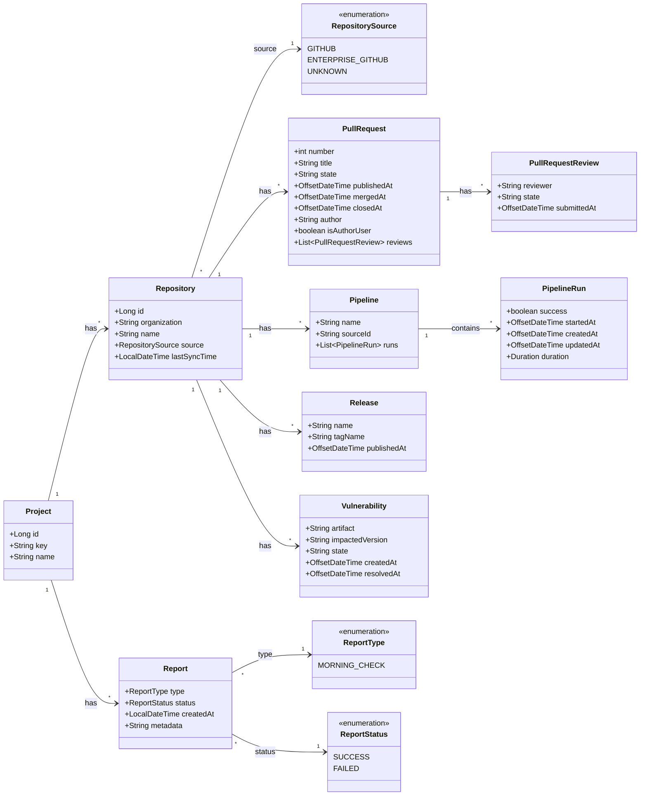

# DevOps Platform

A tool that pull DevOps metadata (Pull Requests, Pipelines, Releases, Vulnerabilities) from multiple repositories given
a project and also allow to attach checks reports to projects

## Main operations via Endpoints

| Endpoints                                                   | Description                                      |
|-------------------------------------------------------------|--------------------------------------------------|
| `PUT` `/api/v1/projects/{projectKey}/do-sync`               | Synchronize all repositories for a given project |
| `POST` `/api/v1/projects/{projectKey}/reports/{reportType}` | Add report for a given project                   |

## Data Model

The following class diagram describes the internal data structures of a Project

## Pipelines

| Event            | Description                                                                | Pipeline                                                                                                                                                                                                                                | 
|------------------|----------------------------------------------------------------------------|-----------------------------------------------------------------------------------------------------------------------------------------------------------------------------------------------------------------------------------------|
| `push` on `main` | Pre-Checks (test + codecov + sonar)                                        |                                               |
| `pull request`   | Checks (test + sonar)                                                      |                                       |
| `weekly`         | Dependabot updates   maintaining maven and github actions dependencies |  |
