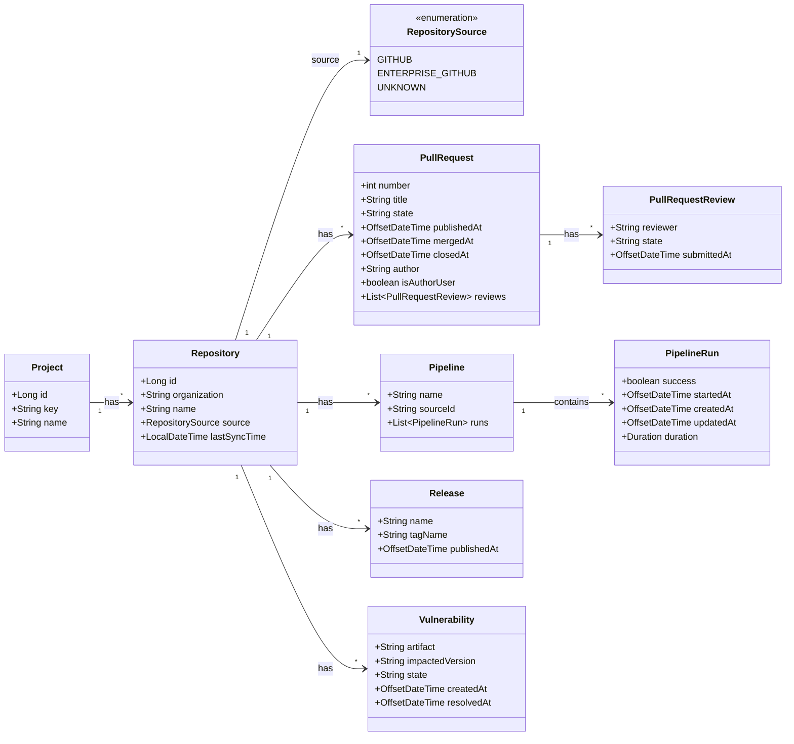

# DevOps Metadata Syncer


[](https://sonarcloud.io/summary/new_code?id=elieahd_devops-metadata-syncer)
[](https://codecov.io/gh/elieahd/devops-metadata-syncer)

A tool that pull DevOps metadata (Pull Requests, Pipelines, Releases, Vulnerabilities) from multiple repositories given
a project

## Commands

Every invocation requires the following global argument:

| Argument    | Required | Description                        |
|-------------|----------|------------------------------------|
| `--command` | Yes      | The name of the command to execute |

### `sync-project`

Sync Metadata for a given project

**Arguments:**

| Argument    | Required | Type   | Description            |
|-------------|----------|--------|------------------------|
| `--project` | Yes      | String | The key of the project |

**Usage:**

```
--command=sync-project --project=<project>
```

```bash
java -jar devops-metadata-syncer.jar \
  --command=sync-project \
  --name=MyProject 
```

### `sync-repository`

Sync Metadata for a given repository

**Arguments:**

| Argument        | Required | Type   | Description                                           |
|-----------------|----------|--------|-------------------------------------------------------|
| `--organiation` | Yes      | String | The repository organization                           |
| `--repository`  | Yes      | String | The repository name                                   |
| `--source`      | No       | String | The repository Source (GitHub, EnterpriseGitHub, ...) |

**Usage:**

```
--command=sync-repository --organization=<org> --repository=<repository> --source=<source>
```

```bash
java -jar devops-metadata-syncer.jar \
  --command=sync-repository \
  --organization=<org> \
  --repository=<repository> \ 
  --source=<source>
```

## Data Model

The following class diagram describes the internal data structures of a Project



## Pipelines

| Event            | Description                                                                | Pipeline                                                                                                                                                                                                                                | 
|------------------|----------------------------------------------------------------------------|-----------------------------------------------------------------------------------------------------------------------------------------------------------------------------------------------------------------------------------------|
| `push` on `main` | Pre-Checks (test + codecov + sonar)                                        | [](https://github.com/elieahd/devops-metadata-syncer/actions/workflows/deploy.yaml)                                              |
| `pull request`   | Checks (test + sonar)                                                      | [](https://github.com/elieahd/devops-metadata-syncer/actions/workflows/pr-checks.yaml)                                      |
| `weekly`         | Dependabot updates <br/> maintaining maven and github actions dependencies | [](https://github.com/elieahd/devops-metadata-syncer/actions/workflows/dependabot/dependabot-updates) |
